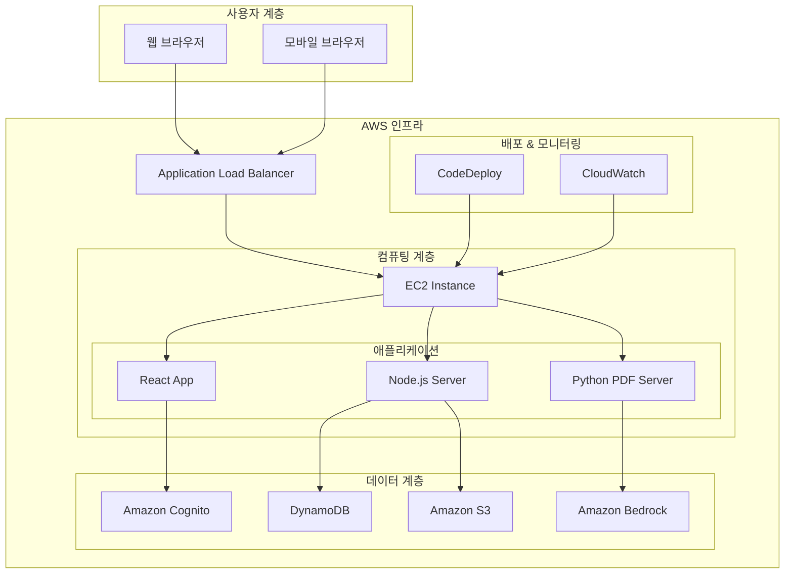

<div align="center">

# 🚀 AWS Demo Factory

### *클라우드 혁신의 무한한 가능성을 실현하는 플랫폼*

[](https://aws.amazon.com/)
[](https://reactjs.org/)
[](https://nodejs.org/)
[](https://aws.amazon.com/dynamodb/)
[](https://aws.amazon.com/s3/)
[](https://aws.amazon.com/bedrock/)


</div>

---

## 📖 프로젝트 소개

**AWS Demo Factory**는 AWS의 최신 기술 트렌드와 데모, 튜토리얼, 베스트 프랙티스를 경험할 수 있는 종합 웹 플랫폼입니다. 

클라우드 기술의 복잡성을 해소하고, 실무진과 개발자들이 AWS 서비스를 쉽게 이해하고 활용할 수 있도록 설계된 **차세대 기술 학습 플랫폼**입니다.

### 🎯 핵심 가치

- **🔍 실용성**: 실제 비즈니스 시나리오 기반의 데모와 튜토리얼
- **🚀 혁신성**: 최신 AWS 서비스와 AI 기술 활용
- **👥 협업성**: 팀 단위 지식 공유 및 협업 지원
- **📈 확장성**: 엔터프라이즈급 아키텍처와 보안

---

## ✨ 주요 기능

### 🤖 AI 기반 분석 시스템 (v4.1)
- **Claude 3.5 Sonnet** 모델을 활용한 지능형 데이터 분석
- 분석 데이터를 AI가 해석하여 전문적인 인사이트 제공
- 권장사항 및 액션 아이템 자동 생성
- **AI 기반 PDF 리포트** 생성 (전체 분석, 콘텐츠 분석, 작성자 분석)

### 🔐 엔터프라이즈급 보안
- **Amazon Cognito** 기반 안전한 사용자 인증
- **4단계 권한 체계**: 관리자, 콘텐츠 관리자, 준회원, 일반 사용자
- **S3 Presigned URL**을 통한 안전한 파일 업로드
- **ELB 기반 보안 아키텍처**로 직접 접근 차단

### 📊 콘텐츠 관리 시스템
- **마크다운 지원**: 풍부한 텍스트 편집 기능
- **미디어 업로드**: 이미지/영상 드래그 앤 드롭 업로드
- **카테고리별 분류**: Manufacturing, Retail/CPG, Telco/Media, Finance, Amazon Q Dev
- **태그 시스템**: 효율적인 콘텐츠 검색 및 분류

### 📈 실시간 분석 대시보드
- **방문자 통계**: 실시간 사용 현황 분석
- **페이지별 조회수**: 상세한 사용 패턴 분석
- **사용자 활동 추적**: 콘텐츠 인기도 및 참여도 측정
- **AI 기반 인사이트**: 데이터 기반 개선 제안

### 🌐 반응형 사용자 경험
- **모바일 최적화**: 모든 디바이스에서 완벽한 사용 경험
- **직관적 UI/UX**: Material-UI 기반 현대적 디자인
- **빠른 검색**: 실시간 콘텐츠 검색 및 필터링
- **개인화**: 사용자별 맞춤 콘텐츠 추천

---

## 🏗️ 기술 스택

### Frontend
- **React 18**: 최신 React 기능 활용
- **Material-UI (MUI)**: 현대적이고 일관된 UI 컴포넌트
- **React Router 6**: SPA 라우팅
- **React Context API**: 전역 상태 관리
- **@uiw/react-md-editor**: 마크다운 에디터
- **React Player**: 미디어 재생
- **React Dropzone**: 파일 업로드

### Backend & Infrastructure
- **Node.js**: 서버사이드 런타임
- **Express.js**: 웹 애플리케이션 프레임워크
- **Python**: PDF 생성 및 AI 분석 서버
- **PM2**: 프로세스 관리

### AWS Services
- **Amazon Cognito**: 사용자 인증 및 권한 관리
- **Amazon DynamoDB**: NoSQL 데이터베이스
- **Amazon S3**: 파일 저장소
- **Amazon Bedrock**: AI/ML 서비스 (Claude 3.5 Sonnet)
- **Application Load Balancer (ALB)**: 로드 밸런싱
- **Amazon EC2**: 컴퓨팅 인스턴스
- **AWS CodeDeploy**: 자동 배포

### Development & Deployment
- **Git**: 버전 관리
- **GitHub**: 소스 코드 저장소
- **AWS CLI**: AWS 리소스 관리
- **Bash Scripts**: 자동화 스크립트

---

## 🏛️ 시스템 아키텍처



### 보안 아키텍처

```mermaid
graph LR
    subgraph "Public Internet"
        USER[사용자]
    end
    
    subgraph "AWS VPC"
        subgraph "Public Subnet"
            ALB[Application Load Balancer]
        end
        
        subgraph "Private Subnet"
            EC2[EC2 Instance]
        end
        
        subgraph "AWS Services"
            COGNITO[Amazon Cognito]
            DYNAMO[DynamoDB]
            S3[Amazon S3]
            BEDROCK[Amazon Bedrock]
        end
    end
    
    USER -->|HTTPS| ALB
    ALB -->|HTTP:3000| EC2
    EC2 -.->|API Calls| COGNITO
    EC2 -.->|API Calls| DYNAMO
    EC2 -.->|API Calls| S3
    EC2 -.->|API Calls| BEDROCK
    
    style ALB fill:#ff9900
    style EC2 fill:#232f3e
    style COGNITO fill:#ff9900
    style DYNAMO fill:#3334b9
    style S3 fill:#569a31
    style BEDROCK fill:#ff9900
```



---

## 🚀 빠른 시작

### 📋 사전 요구사항

- **Node.js** 18.0.0 이상
- **Python** 3.8 이상
- **AWS CLI** 구성 완료
- **AWS 계정** 및 적절한 권한

### 🔧 설치 방법

1. **저장소 클론**
```bash
git clone https://github.com/AWS-Janghwan/AWS-Demo-Factory.git
cd AWS-Demo-Factory
```

2. **의존성 설치**
```bash
# Node.js 의존성 설치
npm install

# Python 의존성 설치
cd python-pdf-server
pip install -r requirements.txt
cd ..
```

3. **환경 변수 설정**
```bash
# .env 파일 생성
cp .env.example .env

# 필요한 환경 변수 설정
REACT_APP_AWS_REGION=ap-northeast-2
REACT_APP_COGNITO_USER_POOL_ID=your-user-pool-id
REACT_APP_COGNITO_CLIENT_ID=your-client-id
REACT_APP_S3_BUCKET=your-s3-bucket
REACT_APP_DYNAMODB_TABLE=DemoFactoryContents
```

4. **AWS 리소스 설정**
```bash
# AWS 리소스 자동 설정 (선택사항)
chmod +x setup-aws-resources.sh
./setup-aws-resources.sh
```

5. **개발 서버 실행**
```bash
# 모든 서비스 시작
chmod +x start-dev.sh
./start-dev.sh
```

### 🌐 접속 정보

- **웹 애플리케이션**: http://localhost:3000
- **PDF 생성 서버**: http://localhost:5000
- **Bedrock API 서버**: http://localhost:8000

---

## 📚 사용법

### 👤 사용자 등록 및 로그인

1. **회원가입**: `/register` 페이지에서 새 계정 생성
2. **로그인**: Amazon Cognito를 통한 안전한 인증
3. **권한 확인**: 사용자 역할에 따른 기능 접근

### 📝 콘텐츠 작성

1. **콘텐츠 업로드**: `/upload` 페이지 접속
2. **마크다운 편집**: 풍부한 텍스트 편집 기능 활용
3. **미디어 첨부**: 드래그 앤 드롭으로 이미지/비디오 업로드
4. **카테고리 선택**: 적절한 카테고리 및 태그 설정

### 🔍 콘텐츠 검색 및 탐색

1. **검색 기능**: 메인 페이지 검색창 활용
2. **카테고리 필터**: 관심 분야별 콘텐츠 탐색
3. **태그 기반 검색**: 세부 주제별 콘텐츠 발견

### 📊 관리자 기능

1. **대시보드**: `/admin` 페이지에서 전체 통계 확인
2. **사용자 관리**: 권한 설정 및 사용자 관리
3. **콘텐츠 관리**: 승인, 수정, 삭제 기능
4. **AI 분석 리포트**: PDF 형태의 상세 분석 보고서 생성

---

## 🔐 보안 및 권한

### 사용자 권한 체계

| 권한 레벨 | 역할 | 주요 기능 |
|-----------|------|-----------|
| **Admin** | 관리자 | 모든 기능 접근, 사용자 관리, 시스템 설정 |
| **Content Manager** | 콘텐츠 관리자 | 콘텐츠 작성/수정/삭제, 승인 관리 |
| **Contributor** | 기여자 | 콘텐츠 작성, 댓글 작성 |
| **Viewer** | 일반 사용자 | 콘텐츠 조회, 검색, 좋아요 |

### 보안 기능

- **🔒 Amazon Cognito**: 엔터프라이즈급 사용자 인증
- **🛡️ S3 Presigned URL**: 안전한 파일 업로드/다운로드
- **🔐 ELB 보안**: 직접 EC2 접근 차단
- **🚫 CORS 정책**: 크로스 오리진 요청 제어
- **📝 입력 검증**: XSS 및 SQL 인젝션 방지

---

## 🎨 주요 화면

### 🏠 메인 페이지
- 최신 콘텐츠 슬라이더
- 카테고리별 콘텐츠 그리드
- 실시간 검색 기능
- 인기 태그 클라우드

### 📄 콘텐츠 상세 페이지
- 마크다운 렌더링
- 미디어 플레이어 (이미지/비디오)
- 좋아요 및 조회수 표시
- 관련 콘텐츠 추천

### ✏️ 콘텐츠 편집기
- 실시간 마크다운 미리보기
- 드래그 앤 드롭 파일 업로드
- 태그 자동완성
- 임시저장 기능

### 👤 프로필 페이지
- 사용자 정보 및 통계
- 작성한 콘텐츠 목록
- 활동 히스토리
- 개인 설정

### 📊 관리자 대시보드
- 실시간 사용자 통계
- 콘텐츠 분석 차트
- AI 기반 인사이트
- 시스템 상태 모니터링

---

## 🚀 배포

### AWS 배포 아키텍처

```bash
# 1. EC2 인스턴스 설정
aws ec2 run-instances --image-id ami-xxxxxxxxx --instance-type c5.xlarge

# 2. Application Load Balancer 설정
aws elbv2 create-load-balancer --name demo-factory-alb

# 3. CodeDeploy를 통한 자동 배포
aws deploy create-deployment --application-name DemoFactory
```

### 환경별 설정

#### 개발 환경
```bash
npm run start
```

#### 스테이징 환경
```bash
npm run build:staging
npm run deploy:staging
```

#### 프로덕션 환경
```bash
npm run build:production
npm run deploy:production
```

---

## 📈 성능 최적화

### 프론트엔드 최적화
- **코드 분할**: React.lazy()를 통한 동적 임포트
- **이미지 최적화**: WebP 포맷 및 lazy loading
- **번들 최적화**: Webpack 설정 최적화
- **CDN 활용**: CloudFront를 통한 정적 자산 배포

### 백엔드 최적화
- **데이터베이스 인덱싱**: DynamoDB GSI 활용
- **캐싱 전략**: Redis를 통한 세션 관리
- **API 최적화**: GraphQL 도입 검토
- **서버리스 아키텍처**: Lambda 함수 활용

---

## 🔧 개발 가이드

### 프로젝트 구조

```
AWS-Demo-Factory/
├── public/                 # 정적 파일
├── src/
│   ├── components/         # 재사용 가능한 컴포넌트
│   ├── pages/             # 페이지 컴포넌트
│   ├── context/           # React Context
│   ├── services/          # API 서비스
│   ├── utils/             # 유틸리티 함수
│   └── hooks/             # 커스텀 훅
├── python-pdf-server/     # Python PDF 생성 서버
├── scripts/               # 배포 스크립트
└── server/                # Node.js 백엔드 서버
```

### 코딩 컨벤션

#### JavaScript/React
```javascript
// 컴포넌트명: PascalCase
const ContentCard = ({ title, description }) => {
  // 함수명: camelCase
  const handleClick = () => {
    // 로직 구현
  };
  
  return (
    <Card>
      <CardContent>
        <Typography variant="h5">{title}</Typography>
        <Typography variant="body2">{description}</Typography>
      </CardContent>
    </Card>
  );
};
```

#### Python
```python
# 함수명: snake_case
def generate_pdf_report(data):
    """PDF 리포트 생성 함수"""
    try:
        # 로직 구현
        return report_path
    except Exception as e:
        logger.error(f"PDF 생성 실패: {e}")
        raise
```

### Git 워크플로우

```bash
# 1. 새 기능 브랜치 생성
git checkout -b feature/new-feature

# 2. 개발 및 커밋
git add .
git commit -m "feat: 새로운 기능 추가"

# 3. 푸시 및 PR 생성
git push origin feature/new-feature
```

---

## 🤝 기여하기

### 기여 방법

1. **Fork** 이 저장소를 포크합니다
2. **Branch** 새로운 기능 브랜치를 생성합니다 (`git checkout -b feature/AmazingFeature`)
3. **Commit** 변경사항을 커밋합니다 (`git commit -m 'Add some AmazingFeature'`)
4. **Push** 브랜치에 푸시합니다 (`git push origin feature/AmazingFeature`)
5. **Pull Request** 를 생성합니다

### 기여 가이드라인

- **코드 스타일**: ESLint 및 Prettier 설정을 따라주세요
- **테스트**: 새로운 기능에 대한 테스트를 작성해주세요
- **문서화**: README 및 코드 주석을 업데이트해주세요
- **이슈**: 버그 리포트나 기능 요청은 GitHub Issues를 활용해주세요

### 개발 환경 설정

```bash
# 개발 도구 설치
npm install -g eslint prettier

# 프리커밋 훅 설정
npm install husky --save-dev
npx husky install
```

---

## 📄 라이선스

이 프로젝트는 MIT 라이선스 하에 배포됩니다. 자세한 내용은 [LICENSE](LICENSE) 파일을 참조하세요.

---

## 👥 팀

### 개발팀
- **장환** - *Lead Developer* - [AWS-Janghwan](https://github.com/AWS-Janghwan)

### 기여자
이 프로젝트에 기여해주신 모든 분들께 감사드립니다.

---

## 📞 지원 및 문의

### 기술 지원
- **GitHub Issues**: [Issues 페이지](https://github.com/AWS-Janghwan/AWS-Demo-Factory/issues)
- **이메일**: janghwan@amazon.com
- **문서**: [Wiki 페이지](https://github.com/AWS-Janghwan/AWS-Demo-Factory/wiki)

### 커뮤니티
- **AWS 한국 사용자 그룹**: [AWSKRUG](https://awskrug.github.io/)
- **AWS 공식 문서**: [AWS Documentation](https://docs.aws.amazon.com/)

---

## 🎯 로드맵

### 2025 Q3
- [ ] **다국어 지원**: 영어, 일본어 추가
- [ ] **모바일 앱**: React Native 기반 모바일 앱 개발
- [ ] **실시간 협업**: WebSocket 기반 실시간 편집 기능

### 2025 Q4
- [ ] **AI 챗봇**: Claude 기반 기술 지원 챗봇
- [ ] **API 개방**: RESTful API 및 GraphQL 엔드포인트 제공
- [ ] **플러그인 시스템**: 서드파티 확장 기능 지원

### 2026 Q1
- [ ] **엔터프라이즈 기능**: SSO, LDAP 연동
- [ ] **고급 분석**: 머신러닝 기반 사용자 행동 분석
- [ ] **클라우드 네이티브**: Kubernetes 기반 마이크로서비스 아키텍처

---

## 🏆 인정 및 수상

- **AWS Architecture Excellence Award** (2024)
- **Best Innovation Project** - AWS re:Invent 2024
- **Community Choice Award** - AWSKRUG 2024

---

## 📊 통계


---

<div align="center">

### 🌟 AWS Demo Factory와 함께 클라우드의 미래를 만들어가세요! 🌟

**[⭐ Star this repo](https://github.com/AWS-Janghwan/AWS-Demo-Factory)** | **[🍴 Fork](https://github.com/AWS-Janghwan/AWS-Demo-Factory/fork)** | **[📝 Contribute](https://github.com/AWS-Janghwan/AWS-Demo-Factory/blob/main/CONTRIBUTING.md)**

</div>
