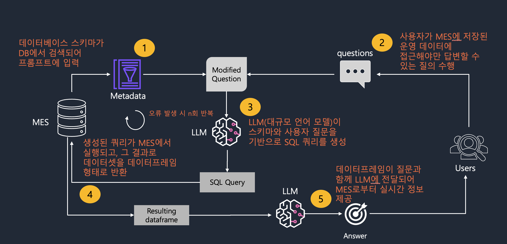

# MES Chatbot 개요

현대 제조업 환경에서 데이터 기반 의사 결정이 매우 중요해졌습니다. 산업 4.0의 도래와 함께 제조 시설에는 센서, 기계, ERP 시스템 등 다양한 출처로부터 방대한 양의 데이터가 쏟아지고 있습니다.

생성형 AI 기술은 사용자와 방대한 텍스트 데이터 사이의 격차를 해소하는 데 진전을 이루었습니다. 그러나 이들의 초점은 주로 텍스트 기반 정보에 맞춰져 있어, 복잡한 산업 시스템의 운영 데이터에 대한 접근과 해석에는 간극이 있었습니다.  

이러한 AI 기능을 운영 데이터 플랫폼에 직접 연결되는 자연어 인터페이스와 통합하면 이 과정을 단순화할 수 있습니다. 이를 통해 깊은 기술 전문성 없이도 모든 사용자가 중요한 의사 결정을 위해 필요한 실시간 데이터에 쉽게 접근할 수 있습니다.

SQL 또는 데이터 분석에 대한 광범위한 기술 전문성이 없는 사람들에게는 이 방대한 데이터 속에서 의미 있는 통찰력을 추출하는 것이 어려운 과제입니다. 이 샘플에서는 텍스트-SQL 변환에 초점을 맞추지만, 동일한 패턴을 지식 그래프 또는 기타 데이터 저장소로 구동되는 다른 산업 데이터베이스를 쿼리하는 데 사용할 수 있습니다.
  

  

# 데모 활용 예시
1. **복잡한 데이터에 대한 간편한 접근**: 대화형 인터페이스를 통해 제조 직원들은 간단한 자연어를 사용하여 복잡한 산업 데이터 저장소를 쿼리할 수 있습니다.  
   예를 들어, 공장 관리자는 "지난 주 A 기계의 생산량을 보여주세요"라고 질문할 수 있으며, SQL 코드를 작성하거나 특정 시스템에 연결된 시각화 도구를 사용할 필요 없이 관련 데이터를 받을 수 있습니다.

2. **향상된 운영 효율성**: 생성형 AI를 통해 데이터 접근을 민주화함으로써 보고서 생성 또는 생산 지표 분석에 소요되는 시간과 노력을 줄일 수 있습니다. 이러한 신속한 데이터 접근을 통해 팀은 신속한 의사 결정을 내릴 수 있어 전반적인 운영 효율성이 향상됩니다.

3. **예방적 유지보수 및 가동 중단 감소**: 유지보수 팀은 자연어 쿼리를 사용하여 장비의 상태와 성능을 평가하고, 문제가 악화되기 전에 잠재적인 문제를 식별하며, 예방적 유지보수를 예약함으로써 계획되지 않은 가동 중단을 줄일 수 있습니다.

4. **품질 관리**: 품질 보증 팀은 자연어를 사용하여 제품 품질, 결함률 또는 배치 일관성 등과 관련된 데이터를 쉽게 쿼리할 수 있어, 품질 관리 프로세스가 간소화되고 제품 표준이 일관되게 충족됩니다.

5. **재고 및 공급망 관리**: 재고 관리자는 외부 애플리케이션을 참조하거나 복잡한 쿼리를 작성할 필요 없이 재고 수준, 재주문 시점 또는 공급업체 성과에 대한 실시간 정보에 쉽게 액세스할 수 있어 재고 관리 및 공급망 운영을 최적화할 수 있습니다.
