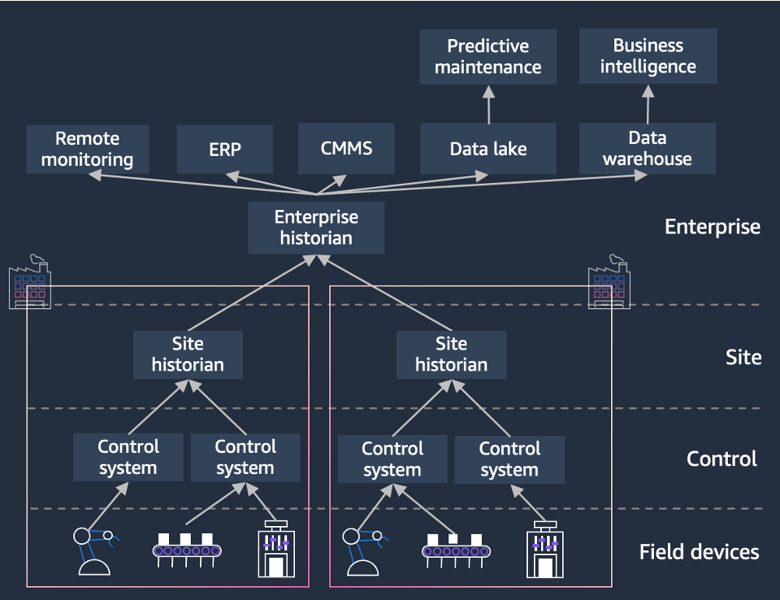

# Historian 데모 개요

제조 현장에서 발생하는 히스토리안 데이터를 AWS 클라우드로 연계하여 모니터링 및 분석할 수 있는 환경을 제공합니다.  
Amazon Timestream, MSK 등의 AWS 서비스를 활용해 실시간 데이터 수집환경을 구축하고, Amazon Managed Grafana와 QuickSight를 통해 모니터링, 시각화 합니다.  
이를 통해 제조 공정의 이상 징후를 신속하게 탐지하고 대응할 수 있습니다. 데이터 시각화로 통해 운전 데이터의 인사이트를 확인할 수 있습니다. 
  

  

# 데모 활용 예시
1. **실시간 설비 진단 및 예측 정비**: 운영자가 "3번 펌프의 최근 7일간 진동 데이터를 분석하고 이상 징후를 알려줘"라고 요청하면, 챗봇이 Historian 데이터를 분석하여 잠재적 문제를 식별하고 예방 정비 권장사항을 제공합니다.

2. **생산 최적화 조언**: "지난 달 대비 생산량이 떨어진 이유를 분석해줘"라는 질문에 챗봇이 Historian의 생산 데이터, 설비 가동 시간, 원자재 투입량 등을 종합적으로 분석하여 인사이트를 제공합니다.

3. **에너지 효율 개선**: "공장 전체의 에너지 소비 패턴을 분석하고 절감 방안을 제시해줘"라는 요청에 대해, 챗봇이 시간대별, 설비별 에너지 사용량을 분석하고 AI 기반의 최적화 전략을 제안합니다.

4. **안전 관리 강화**: "최근 6개월간 안전 관련 이벤트를 요약하고 개선점을 제안해줘"라는 질문에 챗봇이 안전 사고 데이터, 니어미스 보고서, 설비 상태 로그를 분석하여 종합적인 안전 개선 전략을 제시합니다.

5. **품질 관리 최적화**: "제품 A의 불량률이 증가한 원인을 분석해줘"라는 요청에 챗봇이 생산 라인 데이터, 원자재 품질 정보, 환경 조건 등을 종합적으로 검토하여 품질 저하의 근본 원인을 식별합니다.

6. **규제 준수 및 보고서 자동화**: "이번 분기 환경 규제 준수 보고서 작성에 필요한 데이터를 추출하고 요약해줘"라는 요청에 챗봇이 관련 데이터를 자동으로 수집, 분석하여 보고서 초안을 작성합니다.

7. **신입 직원 교육 및 지원**: 신입 운영자가 "터빈 1의 정상 작동 범위와 현재 상태를 설명해줘"라고 물으면, 챗봇이 이해하기 쉬운 방식으로 설명하고 필요시 추가 학습 자료를 제공합니다.

8. **공급망 최적화**: "원자재 A의 재고 수준과 향후 3개월 수요 예측을 분석해줘"라는 요청에 챗봇이 재고 데이터, 과거 사용 패턴, 시장 동향을 종합하여 최적의 재고 관리 전략을 제안합니다.
