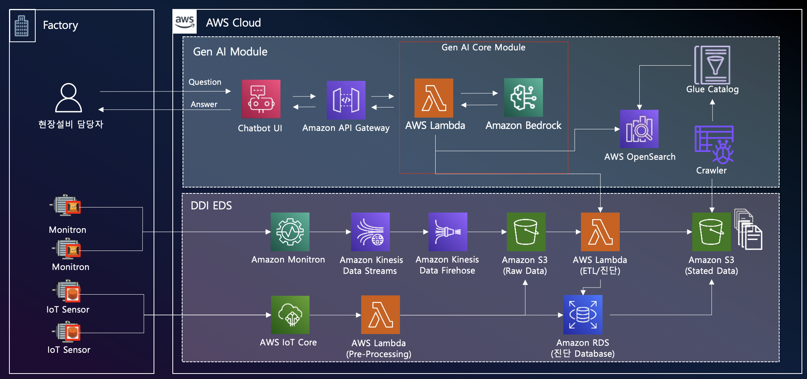
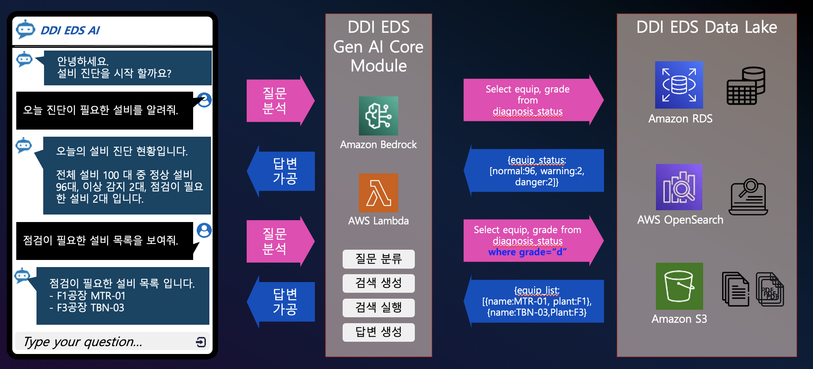

# DDI EDS  Architecture

<!--  -->

## Architecture 설명
### 1. 데이터 수집
- 설비의 모니트론 및 IoT 센서에서 데이터 발생
- 모니트론 서비스와 AWS IoT Core를 통해 S3로 데이터 수집
### 2. 데이터 가공 및 저장
- AWS Lambda를 통한 ETL 처리
- 가공된 데이터를 RDS에 저장
- EDS 웹 서비스를 통해 데이터 서빙
### 3. 검색 데이터 구성
- RDS 데이터를 Bedrock이 활용 가능한 형태로 크롤링
- RDS 쿼리와 OpenSearch 검색을 통한 조회 체계 구축
### 4. 사용자 질의 처리
- 챗봇 UI를 통해 사용자의 자연어 질문 입력
- API Gateway를 통해 GEN AI Core 모듈로 전송
- Lambda를 통해 질문 분석 (의도 파악, 액션 정의, 파라미터 추출)
### 5. 응답 생성 및 전달
- Amazon Bedrock이 필요 데이터 조회
- 조회된 데이터를 자연어 형태로 가공
- 사용자에게 최종 답변 전달

## 활용된 서비스
- Amazon Monitron, AWS IoT Core, Amazon Bedrock, Amazon RDS, Amazon S3, AWS Lambda, Amazon CloudWatch, AWS IAM

