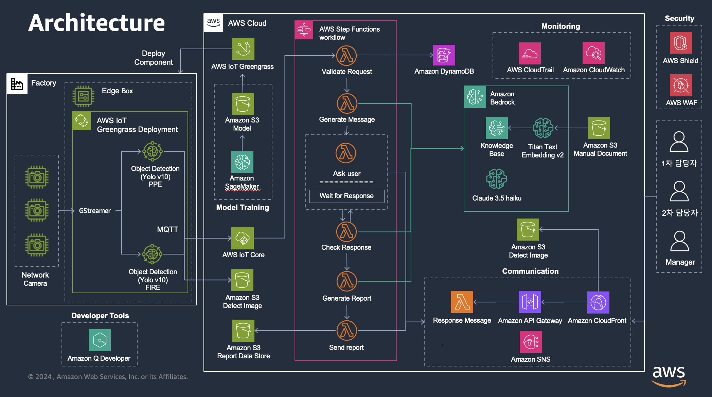

# Smart Fire Detection & Reporting Architecture

<!-- 데모의 아키텍처에 대한 이미지가 들어갑니다. -->

<!-- 아키텍처에 대한 Workflow나 구성에 대한 설명을 해주세요 -->
# Architecture 설명
 1. CCTV로 촬영되는 이미지 스냅샷을 바탕으로 문제 상황이 발생했는지 판단 (파인튜닝된 머신러닝 모델)
 
 2. 문제 상황이 발생했을 경우, 클라우드로 문제상황 전달 (이미지 : S3 /  문제 상황 정보 : IoT Core)

 3. 문제 상황을 전달받은 Bedrock은 해당 정보들을 바탕으로 확인해야되는 매뉴얼을 KnowledgeBase에서 검색

 5. 매뉴얼을 바탕으로 현장 담당자를 선정하고, 문제 처리 보고서에 필요한 정보를 확인

 6. 현장 담당자에게 문제 상황 이미지 스냅샷을 포함하여 필요한 정보를 요청하는 메일 발송

 7. 현장 담당자는 메일 수신 후, 요청된 정보에 대해 답변

 8. Bedrock은 현장 담당자의 답변이 충분하였는 지 판단

 9. 충분하지 않았다면, 현장 담당자에게 추가 정보 요청

 10. 충분히 필요한 정보가 확보되었다면, 기존 보고서 탬플릿을 바탕으로 보고서 작성

 11. 작성된 보고서를 담당자에게 발송  

 

<!-- 서비스를 구성할 때 활용된 서비스명을 나열 해주세요. -->  
# 활용된 서비스
- AWS IoT Core, AWS IoT Greengrass, Amazon Bedrock, AWS Step Functions, Amazon S3, Amazon SNS, AWS Lambda

