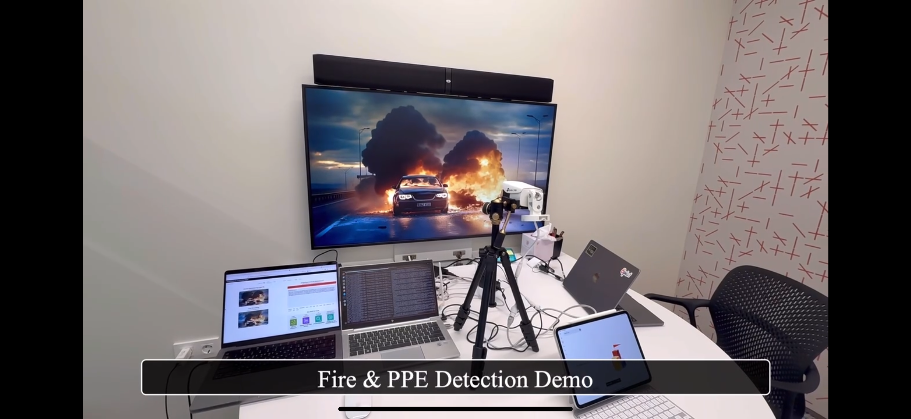

<!-- 데모의 이름과 시놉시스를 작성 해주세요. -->
# Smart Fire Detection & Reporting 개요

현대 안전 관리 환경에서 실시간 데이터 기반 의사 결정은 필수적입니다.
스마트 빌딩, 제조 시설, 물류 센터 등 다양한 산업 환경에서 화재와 같은 비상 상황을 빠르게 감지하고 대응하는 능력은 사람들의 안전과 자산 보호를 위해 매우 중요합니다. 특히, 기존의 수동적인 모니터링과 대응 방식은 제한적이고 비효율적일 수 있습니다.

이 프로젝트는 이미지 기반 화재 감지와 AI 자동화를 결합하여 사람보다 빠르고 정확하게 동작합니다.
화재 감지는 IoT 카메라와 이미지 인식 기술을 통해 이루어지며, AI는 실시간으로 영상을 분석해 화재 징후를 감지합니다. 이를 통해 사람이 직접 모니터링해야 하는 기존 방식보다 훨씬 신속하고 정확한 감지가 가능합니다.

화재가 감지되면 AI는 현장 담당자와 직접 소통하여 필요한 정보를 확보합니다.
AI는 감지된 상황에 대해 현장 담당자와 실시간으로 상호작용하며, 화재의 정도, 주변 상황, 인명 피해 여부 등 중요한 정보를 빠르게 파악합니다. 이를 통해, 보고서 작성이나 후속 대응에 필요한 데이터가 효율적으로 수집됩니다.

이 과정은 사람이 데이터를 분석하고 대응 결정을 내리는 것보다 빠르고 정확합니다.
AI는 조기 감지와 신속한 의사소통을 통해 초기 대응 시간을 단축시키며, 대형 사고로의 확산을 방지합니다. 또한, 반복적인 데이터 수집 작업을 자동화하여 담당자가 보다 중요한 의사 결정과 실행에 집중할 수 있도록 돕습니다.
  

<!-- 데모를 소개할 수 있는 컨셉이나 플로우가 들어갈만한 이미지를 넣어주세요 -->
<!--  -->

  

<!-- 해당 데모를 활용할 수 있는 활용 예시를 작성 해주세요 -->
# 데모 활용 예시
1. ***지하 주차장에서 전기차 화재 감지***: 지하 주차장에서 전기차 배터리가 과열되어 연기와 화염이 발생한 상황.
AI는 즉시 화재를 감지하고, “지하 주차장 D 구역에서 전기차 화재 발생. 주변 차량으로 확산 위험이 높습니다. 대피를 안내하고 소방대에 연락하세요.”라는 알림을 전송합니다. 이후 현장 담당자와 소통하며 구체적인 대응 방안을 조율합니다.

2. ***공장 내부의 기계 과열로 인한 화재 초기 대응***: 공장 생산 라인의 기계에서 과열로 화염이 발생한 상황.
AI는 즉각적으로 화재 위치와 주변 환경을 분석해 "3번 기계 화재 발생. 인근 가연성 물질로 확산 위험이 있습니다. 해당 기계를 정지하고 대피를 시작하세요."라는 정보를 전달하며 초기 대응을 지원합니다.

3. ***물류 창고에서의 화재 확산 방지***: 물류 창고의 한 구역에서 작은 화재가 발생한 상황.
AI는 "창고 A의 2번 구역에서 화염 발생. 화재 확산 가능성이 높습니다. 서쪽 출입구로 대피하세요."라는 알림을 제공합니다. 또한, 추가 확산 위험성을 평가하여 대응 우선순위를 제안합니다.