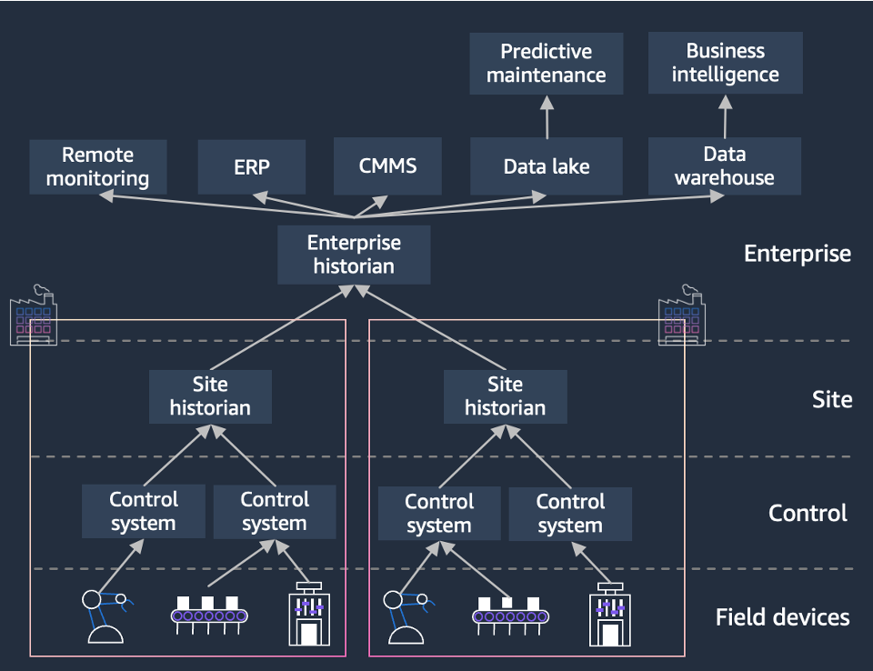

# Historian 데모 개요

제조 현장에서 발생하는 히스토리안 데이터를 AWS 클라우드로 연계하여 모니터링 및 분석할 수 있는 환경을 제공합니다.  
Amazon Timestream, MSK 등의 AWS 서비스를 활용해 실시간 데이터 수집환경을 구축하고, Amazon Managed Grafana와 QuickSight를 통해 모니터링, 시각화 합니다.  
이를 통해 제조 공정의 이상 징후를 신속하게 탐지하고 대응할 수 있습니다. 데이터 시각화로 통해 운전 데이터의 인사이트를 확인할 수 있습니다. 
  

  

# 데모 활용 예시
1. TBU

2. TBU

3. TBU